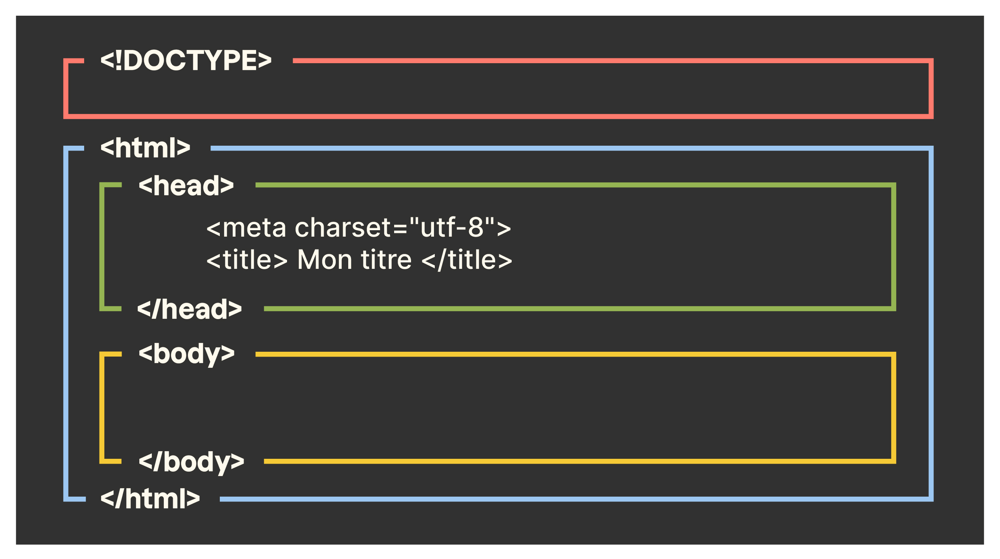

# Introduction

Welcome to the go-to resource for kickstarting your front-end web development journey with HTML5 and CSS3. By delving into HTML and CSS, you'll gain the skills to breathe life into your web projects, creating interfaces that captivate and engage users.

## Table of Contents

- [Introduction](#introduction)
- [Why learn two languages HTML5 and CSS3 separately?](#why-learn-two-languages-html5-and-css3-separately)
- [Summary](#summary)
- [1. Create your first web page in HTML](#1-create-your-first-web-page-in-html)
  - [1.1 Mastering HTML tags](#11-mastering-html-tags)
  - [1.2 Customize tags with attributes](#12-customize-tags-with-attributes)
  - [1.3 Use the basic structure of an HTML page](#13-use-the-basic-structure-of-an-html-page)
  - [1.4 Comment your HTML code](#14-comment-your-html-code)
- [2. Organize your text](#2-organize-your-text)
  - [2.1 Create paragraphs with `<p>` tags](#21-create-paragraphs-with-p-tags)
  - [2.2 Line break with `<br>` orphan tag](#22-line-break-with-br-orphan-tag)
  - [2.3 Create Headings with `<h1>`, `<h2>`, `<h3>`, ...](#23-create-headings-with-h1-h2-h3-)
  - [2.4 Create Lists with `<li>` and `<ul>` or `<ol>`](#24-create-lists-with-li-and-ul-or-ol)
  - [2.5 Emphasize important text](#25-emphasize-important-text)


## Why learn two languages HTML5 and CSS3 separately?

- Why not create a single language that combines HTML and CSS? Why isn't HTML enough?

  - In HTML, you'll use tags to describe your content - you'll write them between angle brackets `< >`.
  - In CSS, you'll use properties to apply style to HTML elements - you'll write them within curly braces `{ }`.

- But how do you apply CSS styles to HTML elements if they are two separate languages?
  The code editor in which you write code allows you to write in different languages, including HTML and CSS.

What we'll do is simply code:
1. A content file in HTML - which will have the extension `.html`;
2. And another style file in CSS - which will have the extension `.css`.

These two files will be saved on your computer. To make them communicate, all you need to do is add a single line of code in the HTML file!
Thanks to this line of code, whenever you click on your HTML file to open it and view your website in the browser, it will automatically call the CSS file.
This will allow you to admire the styling you have applied and modify it at your leisure without affecting the content.

### Summary

- HTML forms the structure of a web page.
- CSS adds style to the structure.
- Both languages complement each other with distinct roles for each.
- The browser is software that reads the languages of the web: HTML and CSS.
- All browsers include development tools, including the inspection tool that provides access to the HTML and CSS of a page.

# 1. Create your first web page in HTML
## 1.1 Mastering HTML tags

HTML, the language of the web, uses elements called tags. These tags are written between angle brackets `<` and `>`. They indicate the nature of the text they enclose, allowing the browser to understand what to display on the screen for website visitors.


Tags come in pairs, consisting of an opening tag and a closing tag:
- `<title> </title>`: "This is the title of the page,"
- ``: "This is an image,"
- `<p> </p>`: "This is a text paragraph," and so on.

There are two types of tags:
1. **Paired Tags:** `<title>This is the title of my page</title>`
2. **Orphan Tags:** These are single tags, often used to insert an element at a specific location, such as an image. There's no need to delimit the start and end of the image; we just tell the computer, "Insert an image here." Hence, the term "orphan tag."

An orphan tag is written like this: ``

## 1.2 Customize tags with attributes

Tags are sometimes accompanied by attributes to provide additional information or configure an element (e.g., ``).


## 1.3 Use the basic structure of an HTML page

Create an `index.html` file and add the following code:

```html
<!DOCTYPE html>
<html lang="en">
<head>
  <meta charset="utf-8">
  <title>HabibiComeToTunisia</title>
</head>
<body>
Experience the perfect blend of comfort and adventure. Welcome to HabibiComeToTunisia.com, your exclusive gateway to unforgettable waterfront getaways in Bizerte, Tunisia.
</body>
</html>
```

- `<html lang="en">`: While not mandatory, specifying the language can prevent potential display issues, especially if you're coding a website in English.
- Tags open and close, nesting in a specific order, similar to Russian nesting dolls:
  

- The first line `<!DOCTYPE html>` is an essential orphan tag, indicating that this is an HTML page.
- The paired `<html> </html>` tag encompasses the entire content of the web page. Inside, there are paired `<head> </head>` and `<body> </body>` tags.
- The `<head> </head>` tag contains two tags providing information to the browser: the encoding and the title of the page.
- The orphan tag `<meta charset="utf-8">` indicates the encoding used in the `.html` file, determining how special characters display (accents, Chinese and Japanese ideograms, etc.).
- The paired `<title> </title>` tag informs the browser of the web page's title, crucial for search results and browser tab display.
- The paired `<body> </body>` tag contains everything that will be displayed on the web page.

## 1.4 Comment your HTML code

In HTML, a comment is simply a memo. It has a specific format: `<!-- This is a comment -->`.
To comment lines (or even multiple lines) in Visual Studio Code:
1. Select the line(s) in question.
2. Use the keyboard shortcut with CTRL + k, then CTRL + c.

To comment  a single line in Intelij:
1. Select the line in question.
2. To comment out a single line, press Ctrl + /

To comment lines (or even multiple lines) in Intelij:
1. Select the line in question.
2. To comment out a single line, press Ctrl + Shift + /


# 2. Organize your text

## 2.1 Create paragraphs with `<p>` tags

The `<p>` tags are used to delimit paragraphs in HTML:

```html
<!DOCTYPE html>
<html lang="en">
<head>
  <meta charset="utf-8">
  <title>HabibiComeToTunisia</title>
</head>
<body>
<p>
  Experience the perfect blend of comfort and adventure. Welcome to HabibiComeToTunisia.com, your exclusive gateway to unforgettable waterfront getaways in Bizerte, Tunisia.
</p>

<p>
  Indulge in the epitome of luxury with our exquisite range of villas, mini-villas, and apartments, offering an opulent selection from cozy studios to expansive 5-bedroom sanctuaries by the azure shores of Bizerte.
</p>

</body>
</html>
```

## 2.2 Line break with `<br>` orphan tag

To create a line break, use the `<br>` orphan tag (for break); it does not require closing:

```html
<!DOCTYPE html>
<html lang="en">
<head>
  <meta charset="utf-8">
  <title>HabibiComeToTunisia</title>
</head>
<body>
<p>
  Experience the perfect blend of comfort and adventure. Welcome to HabibiComeToTunisia.com, your exclusive gateway to unforgettable waterfront getaways in Bizerte, Tunisia.
</p>

<p>
  Indulge in the epitome of luxury with our exquisite range of villas, mini-villas, and apartments,<br>offering an opulent selection from cozy studios to expansive 5-bedroom sanctuaries by the azure shores of Bizerte.
</p>

</body>
</html>
```

## 2.3 Create Headings with `<h1>`, `<h2>`, `<h3>`, ...

```html
<!DOCTYPE html>
<html lang="en">
<head>
  <meta charset="utf-8">
  <title>HabibiComeToTunisia</title>
</head>
<body>
<h1>Habibi welcome to Tunisia!</h1>
<p>
  Experience the perfect blend of comfort and adventure. Welcome to HabibiComeToTunisia.com, your exclusive gateway to unforgettable waterfront getaways in Bizerte, Tunisia.
</p>

<h2>Convenient Booking</h2>
<p>
  Indulge in the epitome of luxury with our exquisite range of villas, mini-villas, and apartments,<br>offering an opulent selection from cozy studios to expansive 5-bedroom sanctuaries by the azure shores of Bizerte.
</p>

<h3>Our Offer</h3>
- Villas<br>
- Mini-villas<br>
- Apartments<br>

</body>
</html>
```

## 2.4 Create Lists with `<li>` and `<ul>` or `<ol>`

### Step 1: Enclose list items with `<li> </li>`
To mark elements in a list, use `<li> </li>` (for "listed item"). Then, insert them all inside another tag to indicate whether it's an unordered list or an ordered list.

### Step 2: Insert the list into `<ul> </ul>` or `<ol> </ol>`
- `<ul>` tags (for "unordered list") indicate the start of an unordered list, also known as a bulleted list.
- `<ol>` tags (for "ordered list") indicate the start of an ordered list, or a numbered list.

Here's an example:

```html
<!DOCTYPE html>
<html lang="en">
<head>
  <meta charset="utf-8">
  <title>HabibiComeToTunisia</title>
</head>
<body>
<h1>Habibi welcome to Tunisia!</h1>
<p>
  Experience the perfect blend of comfort and adventure. Welcome to HabibiComeToTunisia.com, your exclusive gateway to unforgettable waterfront getaways in Bizerte, Tunisia.
</p>

<h2><em>convenient booking</em></h2>
<p>
  Indulge in the epitome of luxury with our exquisite range of villas, mini-villas, and apartments,<br>offering an opulent selection from cozy studios to expansive 5-bedroom sanctuaries by the azure shores of Bizerte.
</p>
<h3><mark>Our offer</mark></h3>
<ul>
  <li>Villas</li>
  <li>Mini-villas</li>
  <li>Apartments</li>
</ul>

<p>
  Embark on a blissful tourist journey in <strong>Bizerte</strong>, where each day unfolds with</p>
<h4>your journey:</h4>
<ol>
  <li>A sumptuous breakfast</li>
  <li>Sun-soaked moments on pristine beaches</li>
  <li>Enchanting explorations of local treasures, and tranquil evenings immersed in the vibrant culture of this coastal haven.</li>
</ol>

</body>
</html>
```

## 2.5 Emphasize important text

In web page text, you may want to highlight specific words. The most commonly used tag for this is `<strong>`, but HTML offers various ways to emphasize

text on your page.

| Tags                 | Browser Rendering               |
|----------------------|---------------------------------|
| `<mark></mark>`      | Highlight the text.             |
| `<em></em>`          | Make the text italic.           |
| `<strong></strong>`  | Make the text bold.             |

